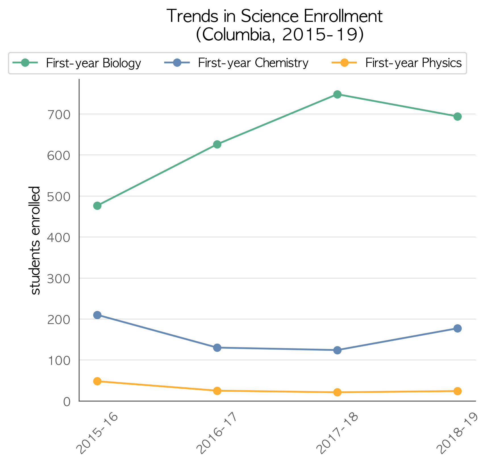
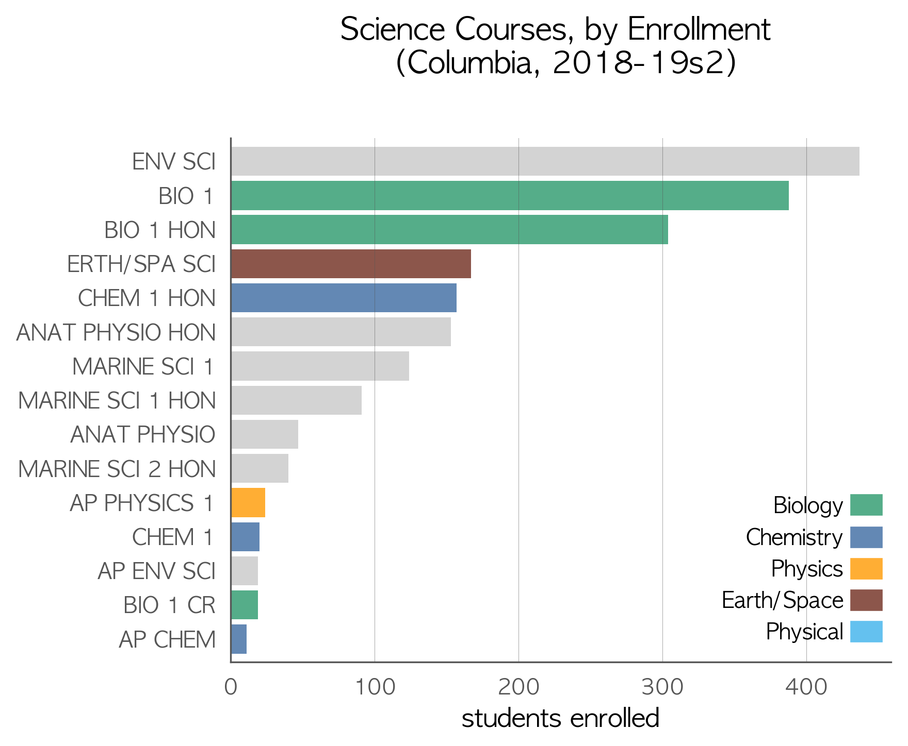
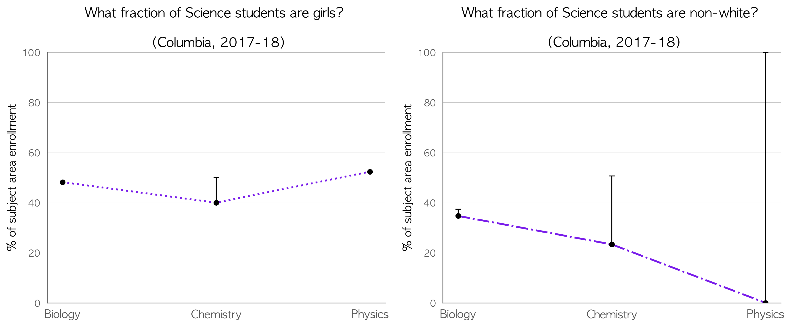

# How is Columbia doing in science?  
Two things to consider when viewing the plots below are:  
1. Chemistry and physics aren’t just for future physicists and engineers. Students who take chemistry and physics are more competitive in trade/technical programs and careers. They’re also **four times** more likely to graduate college on time.  
1. Low overall enrollment in chemistry and physics courses is usually accompanied by an *underrepresentation* of girls and students of color in those courses.  

Most schools with high chemistry and physics enrollment have this in common:  
- The have reduced or eliminated the gender and racial gap in enrollment.  
- They register students for chemistry and physics courses **by default** and provide an easy way to opt out – a parent or guardian personally calls or comes in to sign an override form.  
- Their parents, students, teachers, guidance, and administrators are all, at least somewhat, convinced this is worth doing. That's often done by sharing the data on this page and on the [Why Physics page](https://adamlamee.github.io/why_physics).  

## Enrollment in core courses  
State exams, school grades, and *Newsweek* rankings are one measure of quality. For a predictor of students' actual career and college readiness, look at how many students take chemistry and physics instead. The States and other countries that excel in science preparation have chemistry and physics enrollment rates above 80%. Florida averages around 79% and 22%, respectively. You can click the images to zoom.  
Plots for individual schools can be viewed [here](https://github.com/adamlamee/FL-STEM/tree/master/School_plots) (see notes about the data and the end of this page).  
  
Questions to ask:  
- In relation to Biology (required for graduation), what fraction of students are taking chemistry? physics?  
- How does the fraction of students **not enrolled** in chemistry and physics compare with the fraction of students not pursuing trade or university education?  

---
## Electives and non-core courses  
Which courses are your students taking instead of chemistry and physics that may be less beneficial to them in the long term?  
  
Questions to ask:  
- Are the longest bars green, blue, or gold?  
- Electives & non-core courses are in gray. What are most students taking instead of chemistry and physics?  
- Often, those (gray) courses have more girls and students of color enrolled? Is that a problem in your area? The plots below may shed some light on that.  
 

---
## Diversity  
In high school science courses, total enrollment is the best predictor of gender and racial equity. When more of a school’s students are enrolled into Chemistry and Physics courses, disparities in gender and race tend to be reduced or eliminated entirely. Schools that require students to **opt-in** to chemistry and physics during registration exhibit the largest disparities in gender and race.  
  
Questions to ask:  
- Since Biology is a required course, it can serve as an estimate of the average student demographics for the area. Is diversity being maintained in chemistry and physics courses?  
- If diversity is being lost in chemistry or physics, does the *course enrollment bar chart* above suggest any courses that may be the leak in the pipeline?  
- What are the larger implications of under-enrolling certain group in courses that are pre-requisites for lucrative trades and college majors?   

---
## About the data  
These analyses were performed by [Adam LaMee](http://www.adamlamee.com). All data came from the Florida Department of Education. Course enrollment data is readily available from the [FLDOE](http://www.fldoe.org/accountability/data-sys/edu-info-accountability-services/pk-12-public-school-data-pubs-reports/students.stml). Enrollment demographics were provided via data request from the fine folks at the [Bureau of PK-20 Education Reporting and Accessibility](http://www.fldoe.org/accountability/accountability-reporting/). If you'd like to see your district's data in a different form or have edited plots, I'll be happy to help. Send an email to adamlamee@gmail.com.  

"1st-year" courses were identified as typical first exposure in the content area by the course codes for 1, 1 honors, and pre-IB/pre-AP/pre-AICE. AP Biology and AP Physics 1 were also included, since some schools offer those as first-time courses. This was done in an effort not to double count students taking a second or third year in a content area (which is great). If it makes a difference to your district's plots, let me know and I’ll be happy to post updates.  

In the couse enrollment bar chart, enrollment is shown for individual courses, sorted by highest enrollment and limited to no more than the 15 most-enrolled. Bars are color-coded for courses in Biology, Chemistry, Physics, Physical Science, and Earth/Space Science. Gray bars represent courses which should be treated as electives taken concurrently or after coursework in Biology, Chemistry, and Physics.  

In the plots of enrollment diversity, each point includes errorbars, though most aren’t large enough to be visible. This arises from student privacy protections in the source data. When fewer than 10 students in a demographic category are enrolled in a course, the number enrolled is not published. The data represent a minimum count, so only the upper half of the errorbars are present. If your district is small or has low enrollment in a subject area, the errorbars may be so large as to make any inference meaningless.  

School-level plots (linked above) don't include enrollment diversity plots since most school-level demographic data categories have fewer than 10 students, making analysis meaningless. The plots also include some middle schools. Due to the challenges inherent in a data set of this size, I opted to include some middle schools with large enrollment in high school course offerings instead of inadvertently dropping some smaller high schools. In a next iteration, I may devise a filter for that (e.g., more than n high school course offerings). If you're up for the challenge, drop me a line.