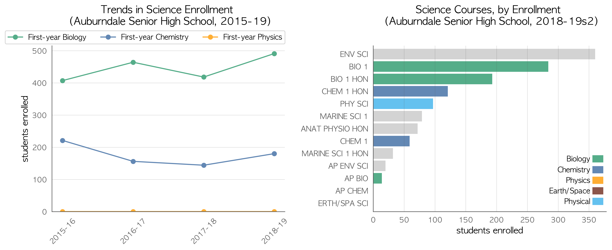

# Schools in Polk  
*Notes*
- See comments about the source data on [the page that brought you here](https://adamlamee.github.io/FL-K12-analyses/plots/District_pages/Polk.html).  
- Only schools with total biology enrollment exceeding a threshold (around 100 students) are included. That makes it less likely a high school was excluded, though it may mean some middle schools were included.  

