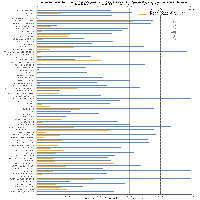

While Florida requires Biology for high school graduation, it is critical for every student capable of trade school or a college degree to take a full year each of chemistry and physics. That prepares them to be four times more likely to finish college on time than their peers. Those students typically earn a letter grade higher in their introductory college STEM courses, impacting scholarships and graduate program admissions. High school chemistry and physics is also the recommended preparation for the most in-demand trade programs in fields from manufacturing to healthcare.

A sustainable solution is for schools to **register students by default into chemistry and physics**, allowing them to opt out with guardian approval. Low overall enrollment in chemistry and physics courses is usually accompanied by an *underrepresentation* of girls and students of color in those courses. Sites that enroll by default have high enrollment rates and little to no demographic disparities in these critical courses.  

## Supporting Evidence  

- [UCF PhysTEC](http://sciences.ucf.edu/physics/phystec/) laid out these concerns a *Letter of Support for High School Science* signed by a range of professionals and addressed to high school administrators, guidance counselors, and teachers.  
- A [Tyson, et. al.](https://aapt.scitation.org/doi/10.1119/1.3639148) noted a 4x increase on-time college graduation rates for high school chemistry and physics takers.  
- FSU Professor [Laura Perez-Felkner](https://www.frontiersin.org/articles/10.3389/fpsyg.2017.00386/full) found girls more likely to underestimate their own academic proficiency, making it so important not to rely on students to elect to take chemistry and physics on their own.  
- [Georgetown University](https://cew.georgetown.edu/cew-reports/valueofcollegemajors/) publishes a report every few years that always says the same thing: the most lucrative college majors require chemistry and physics.  
- Leading professional societies have made these same recommendations for decades, such as the American Association for the Advancement of Science (AAAS), the American Society for Engineering Education (ASEE), the American Physical Society (APS), and the National Research Council (NRC).  

## The State of High School Science in Florida  

 

  

  

  

## Highlights  

Coming soon. A quick note:  
- Monroe and Bay counties showed huge enrollment increases, due in no small part to their amazing teachers, admin, and FSU Professor Paul Cottle’s outreach.  
- Brevard's choice of foregoing their longtime policy of chemistry and physics for all students had played out predictably - enrollment is down 17% in chemistry and 10% in physics.  

## District and School Plots  

View enrollment plots a district and its high schools at the links below. See the **About the Data** section below for assumptions about course offering and progression. If your school or district does something unique, let me know and I’ll update the plots.  

|[ALACHUA](./pages/ALACHUA.md)|[BAKER](./pages/BAKER.md)|  
|[BAY](./pages/BAY.md)|[BRADFORD](./pages/BRADFORD.md)|  
|[BREVARD](./pages/BREVARD.md)|[BROWARD](./pages/BROWARD.md)|  
|[CALHOUN](./pages/CALHOUN.md)|[CHARLOTTE](./pages/CHARLOTTE.md)|  
|[CITRUS](./pages/CITRUS.md)|[CLAY](./pages/CLAY.md)|  
|[COLLIER](./pages/COLLIER.md)|[COLUMBIA](./pages/COLUMBIA.md)|  
|[MIAMI-DADE](./pages/MIAMI-DADE.md)|[DESOTO](./pages/DESOTO.md)|  
|[DIXIE](./pages/DIXIE.md)|[DUVAL](./pages/DUVAL.md)|  
|[ESCAMBIA](./pages/ESCAMBIA.md)|[FLAGLER](./pages/FLAGLER.md)|  
|[FRANKLIN](./pages/FRANKLIN.md)|[GADSDEN](./pages/GADSDEN.md)|  
|[GILCHRIST](./pages/GILCHRIST.md)|[GLADES](./pages/GLADES.md)|  
|[GULF](./pages/GULF.md)|[HAMILTON](./pages/HAMILTON.md)|  
|[HARDEE](./pages/HARDEE.md)|[HENDRY](./pages/HENDRY.md)|  
|[HERNANDO](./pages/HERNANDO.md)|[HIGHLANDS](./pages/HIGHLANDS.md)|  
|[HILLSBOROUGH](./pages/HILLSBOROUGH.md)|[HOLMES](./pages/HOLMES.md)|  
|[INDIAN RIVER](./pages/INDIAN_RIVER.md)|[JACKSON](./pages/JACKSON.md)|  
|[JEFFERSON](./pages/JEFFERSON.md)|[LAFAYETTE](./pages/LAFAYETTE.md)|  
|[LAKE](./pages/LAKE.md)|[LEE](./pages/LEE.md)|  
|[LEON](./pages/LEON.md)|[LEVY](./pages/LEVY.md)|  
|[LIBERTY](./pages/LIBERTY.md)|[MADISON](./pages/MADISON.md)|  
|[MANATEE](./pages/MANATEE.md)|[MARION](./pages/MARION.md)|  
|[MARTIN](./pages/MARTIN.md)|[MONROE](./pages/MONROE.md)|  
|[NASSAU](./pages/NASSAU.md)|[OKALOOSA](./pages/OKALOOSA.md)|  
|[OKEECHOBEE](./pages/OKEECHOBEE.md)|[ORANGE](./pages/ORANGE.md)|  
|[OSCEOLA](./pages/OSCEOLA.md)|[PALM BEACH](./pages/PALM_BEACH.md)|  
|[PASCO](./pages/PASCO.md)|[PINELLAS](./pages/PINELLAS.md)|  
|[POLK](./pages/POLK.md)|[PUTNAM](./pages/PUTNAM.md)|  
|[ST JOHNS](./pages/ST_JOHNS.md)|[ST LUCIE](./pages/ST_LUCIE.md)|  
|[SANTA ROSA](./pages/SANTA_ROSA.md)|[SARASOTA](./pages/SARASOTA.md)|  
|[SEMINOLE](./pages/SEMINOLE.md)|[SUMTER](./pages/SUMTER.md)|  
|[SUWANNEE](./pages/SUWANNEE.md)|[TAYLOR](./pages/TAYLOR.md)|  
|[UNION](./pages/UNION.md)|[VOLUSIA](./pages/VOLUSIA.md)|  
|[WAKULLA](./pages/WAKULLA.md)|[WALTON](./pages/WALTON.md)|  
|[WASHINGTON](./pages/WASHINGTON.md)|[DEAF BLIND](./pages/DEAF_BLIND.md)|  
|[FL VIRTUAL](./pages/FL_VIRTUAL.md)|[FAU LAB SCH](./pages/FAU_LAB_SCH.md)|  
|[FSU LAB SCH](./pages/FSU_LAB_SCH.md)|[FAMU LAB SCH](./pages/FAMU_LAB_SCH.md)|  
|[UF LAB SCH](./pages/UF_LAB_SCH.md)| |  

## About the data
These analyses were performed by [Adam LaMee](http://www.adamlamee.com). The source data comes from the Florida Department of Education. Course enrollment data is readily available from the [FLDOE](http://www.fldoe.org/accountability/data-sys/edu-info-accountability-services/pk-12-public-school-data-pubs-reports/students.stml). Enrollment demographics were provided via data request from the fine folks at the [Bureau of PK-20 Education Reporting and Accessibility](http://www.fldoe.org/accountability/accountability-reporting/). If you’d like to see your district’s data in a different form or get edited plots, I’m happy to help. Send an email to adamlamee@gmail.com.  

“1st-year” courses were identified as typical first exposure in the content area by the course codes for 1, 1 honors, and pre-IB/pre-AP/pre-AICE. AP Biology and AP Physics 1 were also included, since some schools offer those as first-time courses. Separating 1st-year courses was done in an effort to estimate how many students got at least some exposure and not to double count students taking a second or third year in a content area (which is great). If it makes a difference to your district or school, let me know and I’ll be happy to post updates.  

In the course enrollment bar chart, enrollment is shown for individual courses, sorted by highest enrollment and limited to no more than the 15 most-enrolled. Bars are color-coded for courses in Biology, Chemistry, Physics, Physical Science, and Earth/Space Science. Gray bars represent courses which should be treated as electives taken concurrently or after coursework in Biology, Chemistry, and Physics.  

If a course or subject area does not appear in the analyses above it may be due to low enrollment. Information about courses with fewer than ten students enrolled is hidden by FLDOE for reasons of student privacy. 
